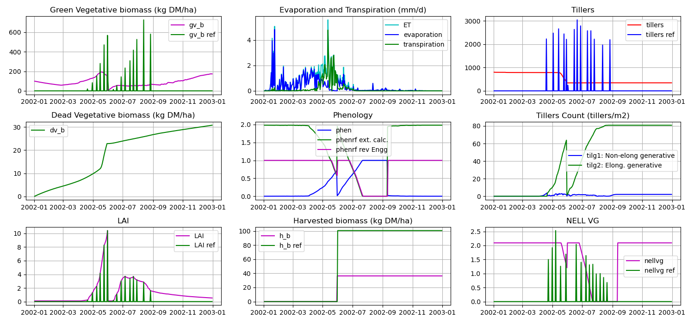

# basgra model

Python development version of BASGRA model

## Output 

This gets updated as the development goes, the bottom center graph is the grass harvest cal Vs val to look for finalization of the code.

